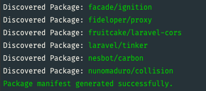
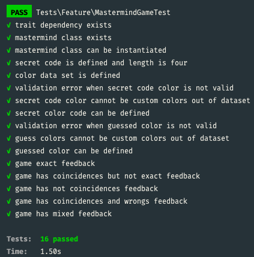

# Mastermind

Mastermind is a puzzle game in which one player (the codebreaker) tries to guess the code their opponent (the codemaker) comes up with.

## Getting Started

These instructions will get you a copy of the project up and running on your local machine for development, playing and testing purposes. 

### Prerequisites
This package requires:
```
nginx or apache server
php >= 7.4
composer
```

### Installing
Clone this public repository
```
git clone https://github.com/tjimenez/mastermind_game.git
```

This project only needs a few basic dependencies related to laravel, you may install it via composer:
```
composer install
```

You should now see a nice message in the terminal like this:



## Running the tests

Once you have run the installer you may test the project using the following artisan command
```
php artisan test
```

If everything is ok, you should see the following result:



## Authors

* **Teodosio Jimenez** - [tjimenez](https://github.com/tjimenez)

## License

This project is free, you may used it for anything you want. 
